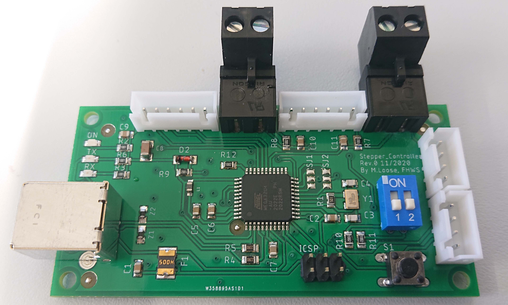
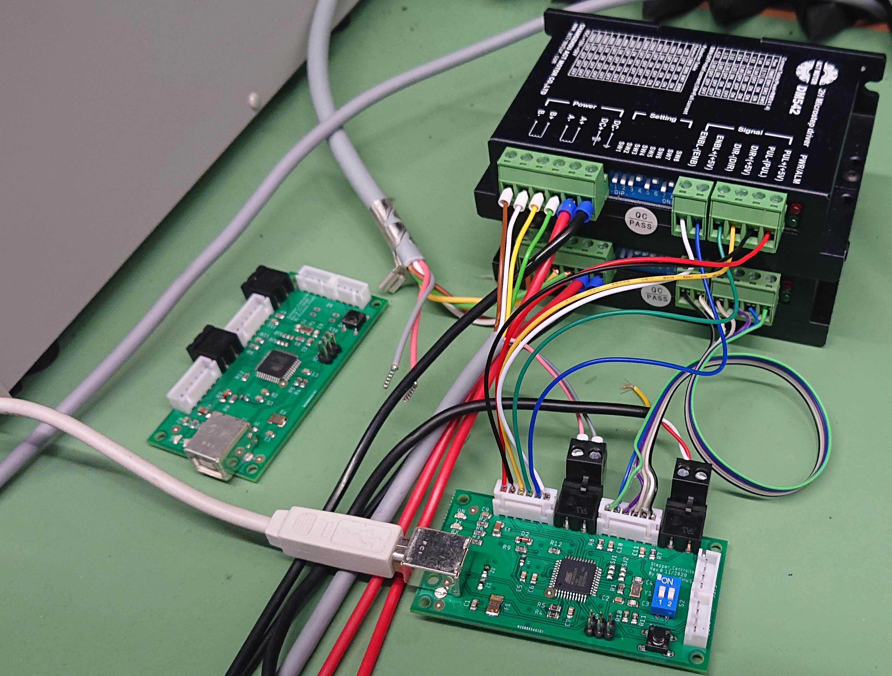

Stepper Controller
==================

Dieses Projekt entstand als kleines Nebenprojekt im Rahmen meiner Masterarbeit und soll eine performante und einfach anzusteuernde Möglichkeit bieten zwei Schrittmotoren mithilfe eines Schrittmotortreibers wie dem DM542 zu betreiben.

||
|:-------------------------------------------------:|:---------------------------------------------------------:
|Bestückte Leiterplatte                             |Beispielhafter Aufbau                                                    

## Befehlsübersicht

Die Übertragung findet
über einen mittels USB-CDC emulierten COM-Port statt. Aus diesem
Grund sind sämtliche Einstellungen zu Baudrate, Daten/Stopbits oder
Paritätsbits hinfällig. Der Controller unterscheidet bei den Befehlen
nicht zwischen Groß- und Kleinschreibung. Das Ende eines Befehles wird
durch ein Carriage Return `<CR> Hex:0x0D` signalisiert. Alternativ wird
auch ein Line Feed `<LF> Hex:0x0A` akzeptiert. Ein Befehl darf eine
maximale Länge von zwölf [ASCII]{acronym-label="ASCII"
acronym-form="singular+short"}-Zeichen zuzüglich des Terminatorzeichens
aufweisen. Wird diese Länge überschritten, so wird das dreizehnte
Zeichen unabhängig vom Inhalt aus Terminator gewertet.\
Zum Testen des Controllers wird eine serielle Konsole benötigt. Dazu
eignet sich die Software *hTerm* [@hTerm], welche sowohl unter Windows
als auch unter Linux ausgeführt werden kann. Um den Motortreiber in eine
Softwareumgebung einzubinden, wurde eine
Treiberklasse in Python entwickelt, die es einem ermöglicht
Steuerbefehle auf einem hohen Level zu senden. Zusätzlich zu dieser
Treiberklasse existiert ebenfalls eine GUI um die Antriebe komfortabel manuell
verfahren zu können.

### Allgemeine Befehle

  |Name               |Befehl     |Erklärung
  |-------------------|-----------|-----------------------------------------------------------------------------------------------------------------------------------------------------
  |Reset              |`RST<cr>`  |Neustart des Controllers. Trennt ebenfalls die USB-Verbindung.
  |Halt               |`HLT<cr>`  |Anhalten aller Antriebe. Neue Befehle werden akzeptiert, Spulen sind weiterhin bestromt.
  |Not-Halt           |`RST<cr>`  |Anhalten aller Antriebe. Neue Befehle werden nicht mehr akzeptiert, Spulenstrom wird abgeschaltet, somit können die Antriebe von Hand bewegt werden
  |Freigabe Not-Halt  |`RST<cr>`  |Rücksetzen des Not-Halt Zustandes. Spulenstrom wird aktiviert und neue Befehle akzeptiert.

### Steuerbefehle

#### Steuerbefehle an den Controller
 | Byte    |Erlaubte Werte                                | Erklärung
 | ------- |----------------------------------------------| -------------------------------------------------
 | 1       |`A` Antrieb A (Hier Drehtisch)                | Antrieb
 |         |`B` Antrieb B (Hier Linearantrieb)            | 
 | 2       |`P` Position                                  | Art des Befehls
 |         |`S` Geschwindigkeit                           | 
 |         |`H` Anhalten (Setzt Sollwert gleich Istwert)  | 
 |         |`Z` Soll- und Istwert auf 0 setzen            | 
 |         |`R` Referenzfahrt                             | 
 | 3       |`=` Zuweisung                                 | Zuweisung oder Abfrage
 |         |`?` Abfrage                                   | 
 | 4\...   |**\<Wert>** Punkt als Dezimalseparator        | Nur für Setzen von Position und Geschwindigkeit
 | N       |**\<CR>** Carriage Return                     | Ende eines Befehls

#### Antwort vom Controller

  |Byte   |Erlaubte Werte                             |Erklärung
  |-------|-------------------------------------------|-------------------------------------
  |1..2   |Byte 1 u. 2 des Befehls                    |Wiederholen des empfangenen Befehls
  |3      |`!` Ausführung Abgeschlossen               |Art der Antwort
  |       |`=` Befehl Empfangen, Antwort auf Anfrage  |
  |4\...  |**\<Wert>** Punkt als Dezimalseparator     |Wert als Antwort einer Anfrage
  |N      |**\<CR>** Carriage Return                  |Ende eines Befehls

### Parametrierbefehle

Um den Controller zu parametrieren muss dieser zunächst mittels des
Befehls `PARAM` in den Parametriermodus gebracht werden. Der Controller
quittiert diesen Modus mit der Ausgabe `PARAM`. In diesem Modus können
die Antriebe nicht verfahren werden. Wird dennoch ein Verfahrbefehl
gesendet, so wird dieser nicht ausgeführt und der Controller antwortet
wie bei einem ungültigen Befehl mit `?`. Der Parametriermodus kann mit
dem Befehl `EXIT` wieder beendet werden. Das Verlassen der
Parametriermodus wird vom Controller mit `OK` Quittiert. Der Controller antwortet auf
Parametrierbefehle in der selben Weise wie auf Steuerbefehle.\

  |Byte    |Erlaubte Werte                          | Erklärung
  |--------|----------------------------------------| ------------------------------------
  |1       |`A` Antrieb A                           | Antrieb
  |        |`B` Antrieb B                           |
  |2\...4  |`SPU`                                   | Schritte pro Einheit
  |        |`VLM`                                   | Geschwindigkeitsbegrenzung \[1,0\]
  |        |`VMX`                                   | Maximale Geschwindigkeit
  |        |`VDF`                                   | Standardgeschwindigkeit
  |        |`PLM`                                   | Positionssbegrenzung \[1,0\]
  |        |`PMX`                                   | Maximale Position
  |        |`PMN`                                   | Minimale Position
  |        |`ROF`                                   | Offset vom Referenzpunkt
  |        |`DIN`                                   | Richtungsumkehrung \[1,0\]
  |        |`RPL`                                   | Polarität Referenzschalter \[1,0\]
  |        |                                        | 0: Öffner, 1: Schließer
  |5       |`=` Zuweisung                           | Zuweisung oder Abfrage
  |        |`?` Abfrage                             | 
  |6\...   |**\<Wert>** Punkt als Dezimalseparator  | 
  |N       |**\<CR>** Carriage Return               | Ende eines Befehls

